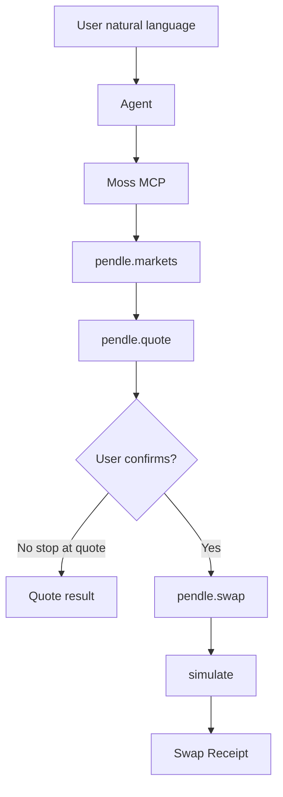

# Week 3 Pendle Demo Studio

Templates and alignment notes for the **Moss Collaboration Demo Studio** track, using the existing
Pendle adapter as the Week 2 evidence base.

## Alignment

Week 3 does **not** repeat Moss onboarding or force a new Adapter. Teams reuse Week 2 work and ship
one demonstrable flow:



| Item | This track |
| --- | --- |
| Base | [`@themoss/protocol-pendle`](../../packages/protocols/pendle) |
| Demo framing | **Monad Protocol Demo** → **PT Yield Assistant** |
| Core Action | `swap` (buy PT with underlying) |
| Supporting queries | `markets`, `quote` |
| Runnable example | [`examples/pendle-demo`](../../examples/pendle-demo) |

## Templates

| File | Day | Purpose |
| --- | --- | --- |
| [team-card.md](./team-card.md) | 1 | Moss Team Card + Week 2 evidence links |
| [use-case-and-scope.md](./use-case-and-scope.md) | 2 | Use Case Card, flow map, demo scope |
| [protocol-risk-brief.md](./protocol-risk-brief.md) | 3 | Protocol & Risk Brief for Pendle PT swaps |
| [demo-checklist.md](./demo-checklist.md) | 4–5 | Acceptance criteria and final submission package |
| [hackathon-readiness.md](./hackathon-readiness.md) | 5 | Week 4 Hackathon backlog card |

Copy each template into your team workspace (Notion, Google Doc, or repo folder) and replace
`[PLACEHOLDER]` fields during the five-day sprint.

## Five-day map

1. **Day 1** — Team Card + evidence links (Pendle PR, this example).
2. **Day 2** — Use case and scope; lock one user, one intent, one core Action.
3. **Day 3** — Risk brief, first end-to-end dry run, Known Issues.
4. **Day 4** — Scenario tests with ≥3 users; freeze demo.
5. **Day 5** — 3-minute pitch, recording, submission package, Hackathon readiness.

## Dev quickstart

```bash
pnpm install
pnpm build
pnpm --filter @themoss/example-pendle-demo swap
```

See [examples/pendle-demo/README.md](../../examples/pendle-demo/README.md) for MCP usage and risk
boundaries.
