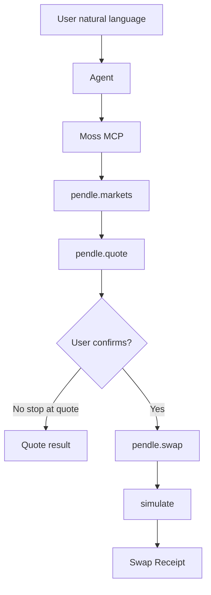

# Use Case Card + Flow Map + Demo Scope

> Day 2 deliverable. One user, one intent, one core Action.

## Use Case Card

| Field | Value |
| --- | --- |
| User | `[PLACEHOLDER — e.g. Monad DeFi user exploring fixed yield via Pendle PT]` |
| Problem | PT markets are hard to discover and quote; users fear signing opaque swap calldata. |
| Intent | Buy PT on a verified Pendle market with a known underlying amount. |
| Core Action | `pendle.swap` (buy PT direction) |
| Supporting queries | `pendle.markets`, `pendle.quote` |
| Success result | User sees market context, quote, simulated swap receipt, and confirms before signing. |
| Out of scope this week | Sell PT, YT, LP, limit orders, aggregators, multi-market routing, auto-signing |

## Flow map

| Step | What happens |
| --- | --- |
| User natural language | User asks to buy PT (or explore markets / get a quote) in plain language. |
| Agent | Interprets intent and drives Moss tools; does not invent calldata. |
| Moss MCP | Surfaces Pendle via `discover` / `load` / `action` / `simulate`. |
| `pendle.markets` | Lists verified Pendle markets (API nomination + on-chain checks). |
| `pendle.quote` | Quotes buying PT for a chosen underlying amount. |
| User confirms? | Human gate: stop with quote data, or proceed to swap simulation. |
| Quote result | Path ends with quote data when the user does not confirm a swap. |
| `pendle.swap` | Builds the unsigned buy-PT Capability tree. |
| `simulate` | Trace-simulates the swap; no signing or broadcast. |
| Swap Receipt | Ordered Receipts for human review before any wallet step. |
|
## Moss Demo Scope

### Real this week

| Component | Notes |
| --- | --- |
| `@themoss/protocol-pendle` | Existing Week 2 adapter (PR #109) |
| `markets` | API nomination + on-chain verification |
| `quote` | RouterStatic quote for buy-PT |
| `swap` + `simulate` | Unsigned Capability tree + trace simulation |
| MCP or CLI driver | `examples/pendle-demo` or Agent via MCP |

### Mock / team-owned

| Component | Notes |
| --- | --- |
| Natural-language UI | Chat or landing page owned by Ops/Frontend |
| Wallet broadcast | Optional; Week 3 minimum stops at simulation + confirmation |
| Portfolio aggregation beyond one market | Out of scope |

### Permission and confirmation

- Agent may call read queries without moving funds.
- Any `swap` path must pause for user review of quote + simulation receipts.
- Wallet signing is never automatic in the demo script.

### Known Issues (starter)

| Issue | Owner | Status |
| --- | --- | --- |
| PR #109 not merged yet | Dev | `[PLACEHOLDER]` |
| Simulation may fail for unfunded `MOSS_ACCOUNT` | Dev | Document; use holder from live tests if needed |
| APY is `inferred` from Pendle API | Research | Must disclose in demo |
| `[PLACEHOLDER]` | `[ROLE]` | `[PLACEHOLDER]` |

## This week we will NOT

- Add a second Protocol or chain.
- Build a generic trading Agent.
- Hide Mock components in the pitch.
- Skip human confirmation on asset-moving steps.
