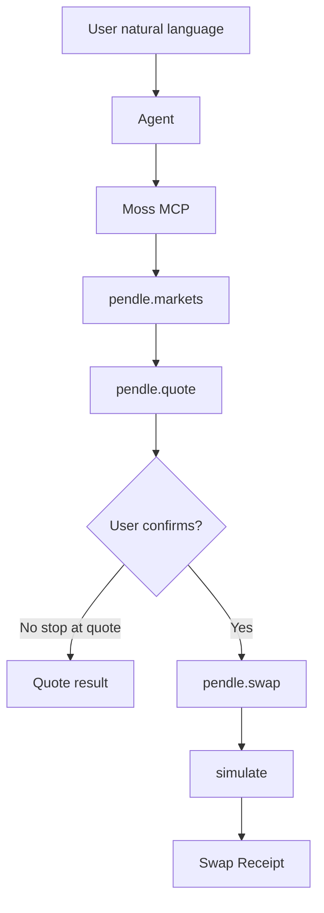

# Pendle PT Yield Assistant demo

Week 3 Moss Collaboration Demo Studio example built on the existing
[`@themoss/protocol-pendle`](../../packages/protocols/pendle) adapter. It demonstrates one
minimal end-to-end flow:



## Demo scenario

**Monad Protocol Demo**, framed as **PT Yield Assistant**:

1. Discover verified Pendle markets (`markets` query).
2. Quote buying PT with the market underlying (`quote` query).
3. Stop at quote data, or on confirmation build a buy-PT `swap` Capability and simulate it.
4. Print ordered Receipts for human review. **No signing or broadcasting.**

Supporting queries (`markets`, `quote`) feed the single core Action (`swap`). Result is either quote data or a swap receipt.

## Prerequisites

Node 22+, pnpm 11, and a built Moss workspace:

```bash
pnpm install
pnpm build
```

Live Monad mainnet RPC access is required. Examples only simulate; they never sign or send.

## Run

```bash
# List verified markets
pnpm --filter @themoss/example-pendle-demo markets

# Quote a buy-PT swap on the first verified market
pnpm --filter @themoss/example-pendle-demo quote

# Full markets → quote → swap → simulate flow
pnpm --filter @themoss/example-pendle-demo swap

# The same flow, driven over MCP the way an Agent drives it
pnpm --filter @themoss/example-pendle-demo mcp
```

The first three call the Registry in-process, which proves Moss reaches Pendle. `mcp` speaks the
MCP protocol to the built server over stdio, which proves an *Agent* can — it walks `discover` →
`load` → `action` → `simulate` and prints the risk labels `load` returns before anything is built.
It needs `pnpm build` first, since it launches `packages/mcp-server/dist/cli.js`.

Optional environment variables:

| Variable | Default | Purpose |
| --- | --- | --- |
| `MOSS_RPC_URL` | Monad public RPC | Override RPC endpoint |
| `MOSS_ACCOUNT` | `0x288dA54F…bede` | Simulated sender; see below |
| `MOSS_SWAP_AMOUNT` | `0.01` | Underlying amount in display units |
| `MOSS_SLIPPAGE_BPS` | `50` | Slippage bound in basis points |

### Why the sender must hold the underlying

The trace simulator prefunds native balance only. A sender that holds no underlying makes the
Router call revert, so `swap` defaults to a third-party read-only EOA that holds the USDat
underlying. Nothing is ever signed or sent on its behalf.

That balance can change at any time. When it runs dry `swap` fails with an explicit message
naming the shortfall — set `MOSS_ACCOUNT` to any address holding the market underlying.

### macOS certificate note

Node's bundled CA list may reject Monad's RPC certificate chain with
`UNABLE_TO_GET_ISSUER_CERT_LOCALLY`, while `curl` succeeds. Point Node at the system roots:

```bash
security find-certificate -a -p /System/Library/Keychains/SystemRootCertificates.keychain \
  > ~/.node-system-roots.pem
export NODE_EXTRA_CA_CERTS=~/.node-system-roots.pem
```

## Drive through MCP

Pendle is already included in the default MCP server composition. After `pnpm build`, point an MCP
client at `packages/mcp-server/dist/cli.js` with `MOSS_RPC_URL` set, then ask:

> Use moss to list Pendle markets, quote buying PT with 0.01 underlying on the first market, simulate the swap, and show the receipts. Do not sign.

The four Moss tools are `discover`, `load`, `action`, and `simulate`. See
[MCP tool contracts](../../docs/mcp-tools.md).

## What is real vs mock

| Piece | Status |
| --- | --- |
| Pendle market discovery + on-chain verification | Real (Monad mainnet) |
| `quote` and `swap` calldata construction | Real |
| Trace simulation and Receipt parsing | Real |
| Wallet signing and transaction broadcast | **Not included** — human confirmation required |
| Natural-language Agent UI | Team-owned (CLI/MCP in this example) |
| Inferred APY from Pendle API | Real fetch, `inferred` provenance — not an on-chain guarantee |

## Risk boundaries

- `swap` is tagged `fundOut`, `approval`, and `priceImpact`.
- Moss builds unsigned transactions and simulates; it never signs or sends.
- PT trades carry expiry, liquidity, and slippage risk; APY shown from the API is informational only.
- Week 3 demos must keep explicit human confirmation before any asset move.

## Week 3 submission templates

Fill-in templates for Team Card, scope, risk brief, and acceptance checklist live in
[`docs/week3-pendle-demo-studio`](../../docs/week3-pendle-demo-studio/README.md).

## Week 2 evidence

This example reuses the Pendle adapter from Week 2 (PR #109) rather than authoring a new Protocol.
